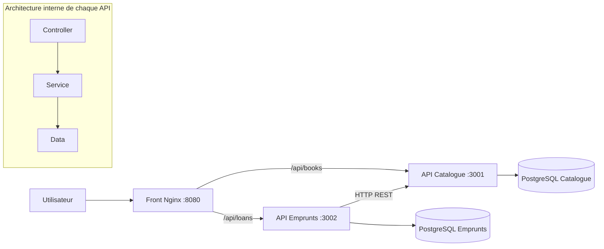
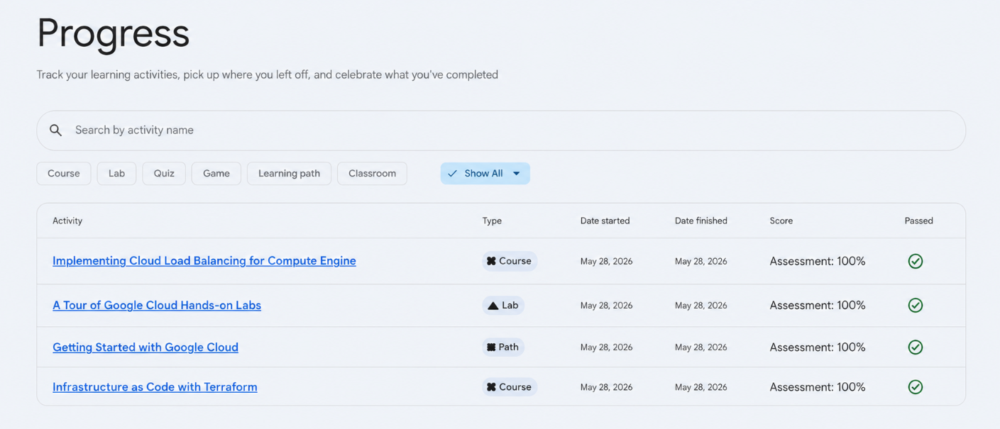

# BiblioFlow - Projet DevOps

[](https://github.com/Issadevs/biblioflow-devops/actions/workflows/ci.yml)

**Auteur : Issa Kane**<br>
**Année : 2025-2026**

> Application distribuée de gestion de bibliothèque réalisée dans le cadre du projet DevOps.

## Documents de remise

- [Rapport final au format PDF](output/pdf/rapport-biblioflow.pdf)
- [Spécification complète des API](docs/openapi.yaml)
- [Historique de la CI GitHub Actions](https://github.com/Issadevs/biblioflow-devops/actions)

## Présentation

BiblioFlow permet de gérer un catalogue de livres et leurs emprunts depuis une interface web responsive.
L'application est composée de deux services backend indépendants :

- **Catalogue** : livres, ISBN et gestion atomique du stock ;
- **Emprunts** : création, suivi et retour des emprunts.

Chaque service possède sa propre base PostgreSQL. Le service Emprunts communique avec le Catalogue par
HTTP et compense automatiquement le stock lorsqu'une opération locale échoue.

## Conformité au cahier des charges

| Exigence                    | Réalisation                                                       |
| --------------------------- | ----------------------------------------------------------------- |
| Dépôt Git                   | Historique structuré sur GitHub                                   |
| Pipeline CI                 | Formatage, ESLint, tests, couverture, build Docker et test E2E    |
| Architecture en couches     | Couches `data`, `services` et `controllers` dans chaque backend   |
| Deux services backend       | API Catalogue et API Emprunts conteneurisées séparément           |
| Tests de toutes les couches | Data, services, controllers, client inter-service et front DOM    |
| Mocks web                   | Supertest pour les API et mock HTTP injecté pour le Catalogue     |
| Bonne couverture            | 99,4 % des lignes et 98,27 % des branches                         |
| Qualité logicielle          | ESLint, Prettier, Zod, erreurs normalisées et conteneurs non-root |
| Bonus front web             | Tableau de bord HTML/CSS/JavaScript responsive                    |
| Bonus base de données       | Deux bases PostgreSQL persistantes et isolées                     |

## Résultats vérifiés

| Contrôle                | Résultat                                                              |
| ----------------------- | --------------------------------------------------------------------- |
| Tests automatisés       | **56 tests réussis, 0 échec**                                         |
| Couverture des lignes   | **99,4 %**                                                            |
| Couverture des branches | **98,27 %**                                                           |
| Analyse ESLint          | **0 erreur, 0 avertissement**                                         |
| Audit npm               | **0 vulnérabilité**                                                   |
| Test E2E Docker         | Création d'un livre, emprunt, retour et restauration du stock validés |
| CI distante             | Jobs « Qualité et tests » et « Docker et intégration » réussis        |

## Architecture



## Exécution pour la démonstration

Prérequis : Docker Desktop avec Docker Compose.

```bash
docker compose up --build
```

Ouvrir ensuite [http://localhost:8080](http://localhost:8080).

Scénario de vérification conseillé :

1. consulter les livres déjà présents dans le catalogue ;
2. ajouter un nouveau livre avec son ISBN et son stock ;
3. enregistrer un emprunt et constater la diminution du stock ;
4. marquer l'emprunt comme rendu et constater la restauration du stock.

Pour arrêter l'application et supprimer les volumes de démonstration :

```bash
npm run docker:down
```

Si le port 8080 est occupé :

```bash
WEB_PORT=18080 docker compose up --build
```

## API principales

| Méthode | Route                                | Fonction                     |
| ------- | ------------------------------------ | ---------------------------- |
| GET     | `/health` sur les ports 3001 et 3002 | Santé des backends           |
| GET     | `/api/books`                         | Liste du catalogue           |
| GET     | `/api/books/:id`                     | Détail d'un livre            |
| POST    | `/api/books`                         | Ajout d'un livre             |
| PATCH   | `/api/books/:id/stock`               | Ajustement atomique du stock |
| GET     | `/api/loans`                         | Liste des emprunts           |
| POST    | `/api/loans`                         | Création d'un emprunt        |
| POST    | `/api/loans/:id/return`              | Retour d'un emprunt          |

## Reproduire les contrôles qualité

Prérequis : Node.js 22 ou plus récent.

```bash
npm ci
npm run quality
```

Commandes complémentaires :

- `npm test` : tests unitaires, HTTP et DOM ;
- `npm run test:coverage` : rapport de couverture dans `coverage/` ;
- `BASE_URL=http://localhost:8080 npm run test:integration` : scénario E2E sur Docker ;
- `npm run lint:report` : rapport ESLint utilisé par le rapport final.

## Preuve Google Labs

Les quatre activités ont été terminées le **28 mai 2026** avec un score de **100 %** :

- Implementing Cloud Load Balancing for Compute Engine ;
- A Tour of Google Cloud Hands-on Labs ;
- Getting Started with Google Cloud ;
- Infrastructure as Code with Terraform.



Cette preuve est également intégrée à la dernière page du [rapport final](output/pdf/rapport-biblioflow.pdf).

## Fiabilité technique

- bases de données séparées pour limiter le couplage entre services ;
- requêtes SQL paramétrées et stock négatif interdit par la base ;
- validation Zod des entrées et erreurs internes masquées ;
- compensation du stock lors d'un échec distribué ;
- healthchecks et ordre de démarrage contrôlé dans Docker Compose ;
- seuils de couverture bloquants et parcours E2E exécuté par la CI.
