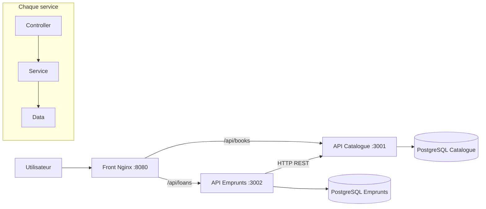

# BiblioFlow

BiblioFlow est une application distribuée de gestion de bibliothèque. Elle sépare le catalogue et les
emprunts en deux services backend autonomes, chacun propriétaire de sa base PostgreSQL, et fournit une
interface web responsive.

## Conformité au sujet

| Exigence                    | Réalisation                                                                   |
| --------------------------- | ----------------------------------------------------------------------------- |
| Dépôt Git                   | Historique structuré et dépôt GitHub                                          |
| Pipeline CI                 | GitHub Actions : formatage, ESLint, tests, couverture et build Docker         |
| Architecture en couches     | Répertoires `data`, `services` et `controllers` dans chaque backend           |
| Deux services back          | API Catalogue et API Emprunts, conteneurisées séparément                      |
| Tests de toutes les couches | Repositories, services et controllers testés avec Vitest                      |
| Mocks web                   | Supertest pour les API et mock HTTP injecté pour l'appel inter-service        |
| Bonne couverture            | Seuils CI : 90 % lignes/instructions/fonctions et 85 % branches               |
| Qualité                     | ESLint, Prettier, validation Zod, erreurs normalisées et utilisateur non-root |
| Bonus front web             | Tableau de bord HTML/CSS/JavaScript responsive                                |
| Bonus base de données       | Deux bases PostgreSQL persistantes et isolées                                 |

## Architecture



Le service Emprunts réserve ou restitue le stock auprès du Catalogue. En cas d'échec d'écriture locale,
une opération de compensation restaure le stock afin d'éviter un état incohérent.

## Démarrage avec Docker

Prérequis : Docker Desktop avec Docker Compose.

```bash
docker compose up --build
```

Ouvrir ensuite [http://localhost:8080](http://localhost:8080). Les API restent également accessibles sur
`http://localhost:3001` et `http://localhost:3002` pour le diagnostic.

Si le port 8080 est déjà utilisé : `WEB_PORT=18080 docker compose up --build`.

Pour arrêter l'application et supprimer les volumes de développement :

```bash
npm run docker:down
```

## Développement et qualité

Prérequis : Node.js 22 ou plus récent.

```bash
npm ci
npm run quality
```

Commandes utiles :

- `npm test` : exécute les tests unitaires et web ;
- `npm run test:coverage` : génère `coverage/index.html` et le résumé JSON ;
- `npm run lint` : lance l'analyse statique ;
- `npm run format:check` : vérifie le formatage ;
- `npm run lint:report` : produit le rapport ESLint exploité par le rapport final.
- `BASE_URL=http://localhost:8080 npm run test:integration` : vérifie un emprunt complet sur les conteneurs.

## API

| Méthode | Route                   | Fonction                     |
| ------- | ----------------------- | ---------------------------- |
| GET     | `/health`               | Santé de chaque backend      |
| GET     | `/api/books`            | Liste du catalogue           |
| GET     | `/api/books/:id`        | Détail d'un livre            |
| POST    | `/api/books`            | Ajout d'un livre             |
| PATCH   | `/api/books/:id/stock`  | Ajustement atomique du stock |
| GET     | `/api/loans`            | Liste des emprunts           |
| POST    | `/api/loans`            | Création d'un emprunt        |
| POST    | `/api/loans/:id/return` | Retour d'un emprunt          |

La spécification complète est disponible dans [docs/openapi.yaml](docs/openapi.yaml).

## Rapport

Le rapport remis est `output/pdf/rapport-biblioflow.pdf`. Pour le régénérer :

```bash
python3 -m venv .venv
.venv/bin/pip install -r requirements-report.txt
npm run test:coverage
npm run lint:report
.venv/bin/python scripts/generate_report.py
```

La preuve personnelle Google Labs doit être placée sous `docs/evidence/google-labs.png` avant la dernière
commande. Le générateur l'insère automatiquement sans modifier le code.

## Décisions de fiabilité

- Chaque service possède sa base, ce qui évite le couplage direct par les tables.
- Les mises à jour de stock utilisent une condition SQL atomique et interdisent un stock négatif.
- Les entrées sont validées avant la couche métier et les erreurs ne divulguent pas de détails internes.
- Les conteneurs attendent les healthchecks de leurs dépendances et redémarrent automatiquement.
- La CI refuse toute baisse sous les seuils de couverture définis dans `vitest.config.js`.
